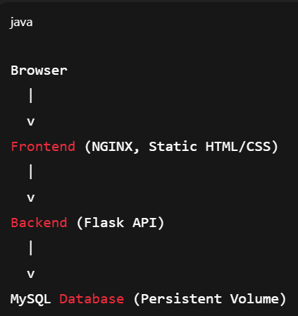
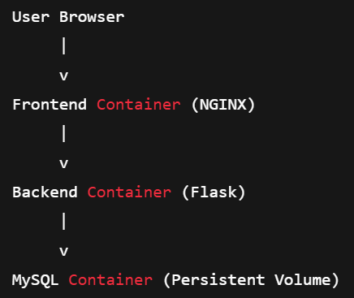
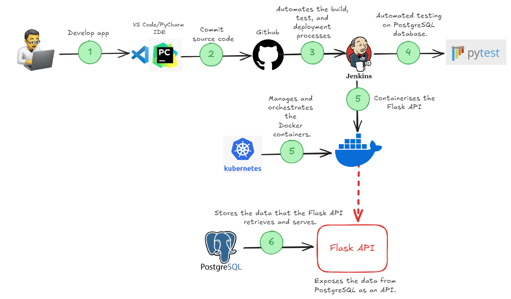

# Capstone-project
A simple 2-tier web application built with a Flask backend, static frontend, and MySQL database, fully containerized using Docker and automated with a Jenkins CI/CD pipeline.

Features

Static frontend (HTML + CSS)

Backend API using Flask

Database using MySQL

Dockerized frontend & backend

Docker Compose for local development

Persistent database storage using volumes

CI/CD pipeline using Jenkins

Container security scanning with Trivy

Architecture Overview

 Project Structure
CAPSTONE-PROJECT/
│
├── frontend/
│   ├── templates/
│   │   ├── login.html
│   │   └── users.html
│   ├── static/
│   │   └── style.css
│   └── Dockerfile
│
├── backend/
│   ├── app.py
│   ├── db_config.py
│   ├── requirements.txt
│   ├── Dockerfile
│   └── .dockerignore
│
├── docker-compose.yml
├── Jenkinsfile
└── README.md

Application Functionality
Login / Registration Page

The application provides a simple form to collect:

Name

Phone number

Address

Email

Workflow

User submits the form

Backend receives the data

Data is stored in MySQL

Registered users are displayed

# Docker Setup
Backend

Python slim image

Multi-stage build

Non-root user

Environment-variable based DB configuration

Frontend

NGINX Alpine image

Static file serving

Non-root user

# Docker Compose (Local Development)

The application is run locally using Docker Compose with:

Frontend service

Backend service

MySQL database

Custom Docker network

Persistent volume for database data

Run the Application
docker-compose up --build

Access URLs
Service	URL
Frontend	http://localhost:8080

Backend	http://localhost:5000

MySQL	localhost:3306
# Database Persistence

MySQL data is stored in a Docker volume:

volumes:
  mysql_data:

This ensures:

Data survives container restarts

Safe for development and testing

# Environment Variables

Backend database configuration is passed via environment variables:

MYSQL_HOST=mysql
MYSQL_USER=appuser
MYSQL_PASSWORD=apppassword
MYSQL_DB=login_db

# CI/CD Pipeline (Jenkins)

The Jenkins pipeline automates the entire lifecycle.

Pipeline Stages

Checkout source code

Build Docker images

Run unit tests inside containers

Scan images using Trivy

Tag Docker images

Push images to Docker registry

Deploy using Docker Compose

# Testing

Unit tests are executed inside the backend container

Ensures production-like test environment

Prevents “works on my machine” issues

# Security

Containers run as non-root users

Vulnerability scanning with Trivy

Pipeline fails on HIGH or CRITICAL vulnerabilities

Database isolated in private Docker network

# Deployment

Deployment is handled automatically by Jenkins:

docker-compose pull
docker-compose up -d

This enables:

Fast deployments

Immutable container images

Easy rollback via image tags

# Prerequisites

Docker

Docker Compose

Jenkins

Git

Docker registry account (Docker Hub or private registry)

# Architecture Diagrams

High-Level Container Architecture

Explanation (Step-by-step)

Backend handles HTTP requests and DB logic

MySQL stores user data persistently

Containers communicate via Docker network

# Docker Compose Network Architecture
Explanation

Docker Compose creates a custom bridge network

Containers communicate using service names

MySQL is not directly exposed to the frontend

Volume attached to MySQL ensures persistence

# CI/CD Pipeline Architecture (Jenkins)
